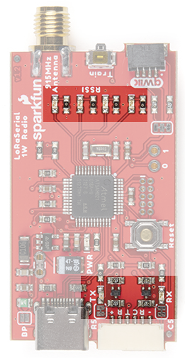

# LED States

A variety of LEDs are visible on the LoRaSerial radio to give the user feedback about the state of the system.

*LEDs on the LoRaSerial*

The following diagram shows the various LEDs on the LoRaSerial device:

        Antenna         Qwiic
    +---------------------------+
    |                           |
    |     G4   G3   G2   G1     |
    |                           |
    |                           |
    |                       Red |
    |                           |
    |                           |
    |            Blue    Yellow |
    |                           |
    +---------------------------+
        USB            Serial

The red LED is the power indicator. G1 through G4 in the diagram above are all green LEDs.

## Radio Reset

When the device is first powered on or is reset, all LEDs will blink quickly three times indicating system reset.

## Training

During Training, the green RSSI LEDs will cylon back and forth. One green LED is lit at a time and the lit LED moves from side to side.

    G4    G3    G2    G1
                       X
                 X
           X
     X
           X
                 X
                       X
                 X
          ...

Once training is complete, the radio will reset causing all LEDS to blink.

## LED Mode - LEDS_RSSI (4)

This is the default mode. The RSSI LEDs will indicate the link's signal strength.

The LED behavior may be changed by using the **AT-SelectLedUse** command and setting the value to one of the mode numbers described in the sections below. As an example, the following commands cause the LEDs to display different information about the radio's behavior.

    +++
    AT-SelectLedUse=4
    ATO

* The RSSI LEDs indicate the signal strength of the last received packet:
    * -70 < RSSI: All green LEDs lit (strong)
    * -100 < RSSI <= -70: G3, G2, G1 LEDs lit, G4 off
    * -120 < RSSI <= -100: G2, G1 LEDs lit, G4 and G3 off
    * -150 < RSSI <= -120: G1 LED lit, all G4, G3 and G2 off (weak)
    * RSSI <= -150: <= All green LEDs off
* The blue TX LED indicates when serial data is received over the radio and sent to the host, either over USB or hardware serial.
* The yellow RX LED indicates when serial data is received from the host and sent over the radio.

## LED Mode - LEDS_MULTIPOINT (0)

This mode gives the user insight into when the link is hopping and when a heartbeat is transmitted/received.

* The G4 LED pulses when the radio transmits a frame.
* The G3 LED is pulse width modulated to indicate the last received RSSI level.
* The G2 LED turns on when the link is up (data can pass).
* The G1 LED pulses when the radio successfully receives a frame.
* The blue LED pulses on the server radio when the server transmits a HEARTBEAT frame. The blue LED pulses on the client radio when the client successfully receives a HEARTBEAT frame from the server.
* The yellow LED pulses each time a channel hop (frequency change) occurs.

## LED Mode - LEDS_RADIO_USE (3)

This mode gives the user insight into when a bad or duplicate frame is detected.

* The G4 LED pulses when the radio transmits a frame.
* The G3 LED is pulse width modulated to indicate the last received RSSI level.
* The G2 LED turns on when the link is up (data can pass).
* The G1 LED pulses when the radio successfully receives a frame.
* The blue LED will blink when the radio receives a bad frame.
* The yellow LED will blink when the radio receives a duplicate frame or receives a frame where the software CRC does not match.
